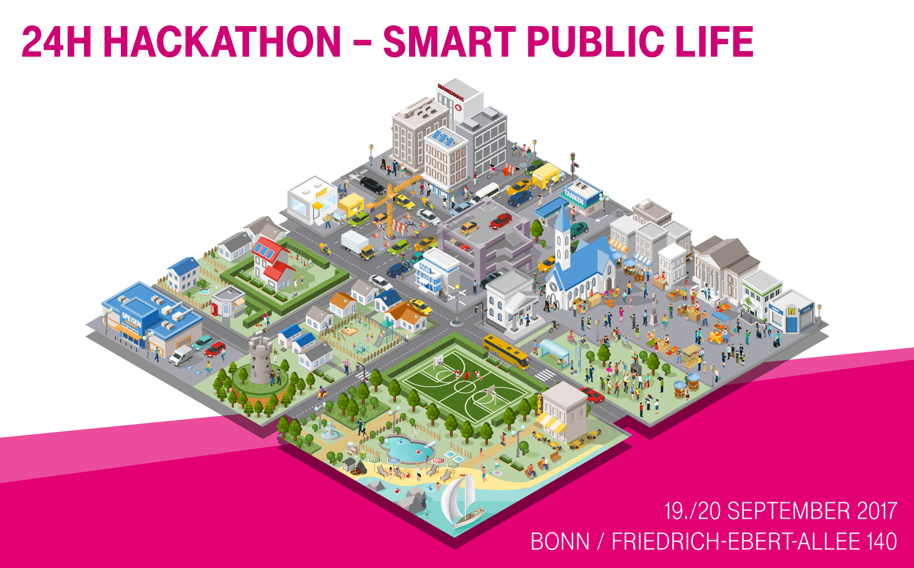

# 24H Hackathon Smart Public Life



Submit your ideas for the City of the Future and take part in the Smart City Public Life Hackathon. Whether you're a developer, a designer or a newbie – we want you!

* **Developers/Professionals** (***SOLD OUT***):  
  Together with your team and a designer, you will develop great ideas and program a prototyping solution within 24 hours.
* **Designers and concept developers** (***SOLD OUT***):  
  From the ideation phase (led by you) through the implementation of your design idea/architecture or user experience expertise, your know-how is needed in many different ways.
* **Non-developers/newbies** (***SOLD OUT***):  
  We have IoT boards for you, too, with which you can work as if you were a programmer. You will be given an introduction on site and have experienced teammates. Have a try and develop your interest for programming!

[Register directly on eventbrite](https://www.eventbrite.de/e/hackathon-smart-public-life-by-deutsche-telekom-tickets-35258968524)

### What is it about?
Make life more comfortable for people living in cities – all on the topic of "Smart Public Life." Over the next few weeks, we will present potential topics, technologies and data that could help you develop a good idea and then realize it at the hackathon.

You can find more information on the [official site](https://www.telekom.com/en/company/public-life-hackathon)

## Results

You can find the results for the different teams in the ```results``` subfolder. If you are interested in the final video you can download it from [here](https://www.magentacloud.de/lnk/TeMS4bUj#file)

## Documentation
Examples and documentation for the Deutsche Telekom Hackathon on 19/20 September in Bonn

* [Calliope Board](documentation/calliope.md)
* [Additional Sensors](documentation/sensors.md)
* [NB-IoT Module](documentation/nb-iot.md)
* [Backend](documentation/backend.md)
* [For our Pro's](documentation/install_yotta.md)
* [Official Repo for the Hackathon from the calliope team with detailed description and additional source code. ALSO A MUST READ!!1!](https://github.com/ubirch/telekom-nbiot-hackathon-2017)

## Provided 3rd Party Hardware
We also got some hardware from Anki and COBI. Check out their documentation, too:
* [ANKI Drive](https://github.com/anki/drive-sdk)
* [ANKI Cozmo](http://cozmosdk.anki.com/docs)
* [COBI Smart Bike connected biking system SDK](documentation/cobi.md)

## Documents

* Ideation phase: [Link](documentation/documents/Ideation.pdf)
* Ideation method description: [Heaven & Hell](documentation/documents/HeavenandHell_A4_EN.PDF)
* Route description: [EN](documentation/documents/Anfahrt_SZexe_Bonn_en.pdf) [DE](documentation/documents/Anfahrt_SZex_Bonn_de.pdf)

## FAQ
* **Is the Hackathon open source?**  
  Yes, the data and software you use during the hackathon are completely open source.  
* **When and where will the Hackathon take place?**  
  Event start: Tuesday, September 19, 2017 at 09:00 a.m.
  Event end: Wednesday, September 20, 2017 at approx. 12:30 p.m.
  Event location:
  Deutsche Telekom AG Headquarters
  Friedrich-Ebert-Allee 140
  53113 Bonn, Germany
* **What is the topic of the hackathon?**  
  This time, the topic is IoT (Internet of Things): The focus is on connected life in the city (Smart Public Life). IoT boards, sensors, and everything the IoT heart desires. The mission is: to make life in the city more convenient, simpler, and more livable for citizens. But without reinventing the smart street light for the thousandth time.
* **Who can take part?**
  * Professional developers
  * Trainee developers
  * Designers and concept developers
  * All non-developers (newbies) with an interest in programming
* **I'm not a developer - what can i do to contribute to the Hackathon?**
  * **As a newbie (non-developer):**  
  We also have IoT boards for you to work with. You will be given an introduction to the IoT board on site by an expert, who will be available to you at all times during the hackathon as a contact. In addition, you will have designers and concept developers by your side to develop and implement a great idea. The Hackathon won't last 24 hours for newbies. Officially, your coding phase will finish at 5.30 p.m. But you will be free to keep on working on your idea. The next day, you come back for the presentation of results.
  * **As a designer/concept developer:**  
  You can support a team in the 24-hour hackathon: starting with the ideation phase, which you will lead, through to implementation of your idea design.  
  You can support newbies in the ideation phase, help them refine their ideas in the development phase and get them fit for the presentation of results.
* **Who covers the cost of the event?**  
  It's free to take part in the hackathon, and the costs of food and hardware, such as the IoT boards and sensors on site are covered. The travel expenses must be covered by your own.


## License
All documentation and examples for the Deutsche Telekom Hackathon 2017 ([**#dthack17**](https://twitter.com/hashtag/dthack17)) are distributed under the conditions of the MIT license. For details see the [LICENSE file](LICENSE).
