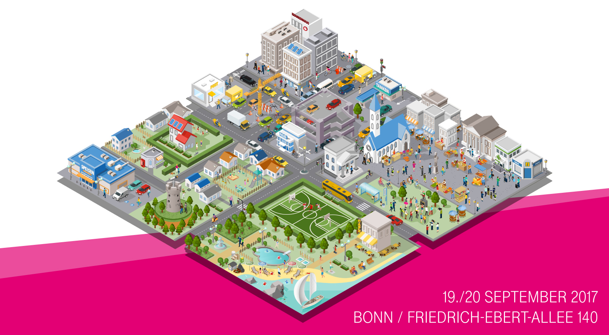

# dthack17
Examples and documentation for the Deutsche Telekom Hackathon on 19/20 September in Bonn

## License
All documentation and examples for the Deutsche Telekom Hackathon 2017 (#dthack17) are distributed under the conditions of the MIT license. For details see the [LICENSE file](LICENSE).
